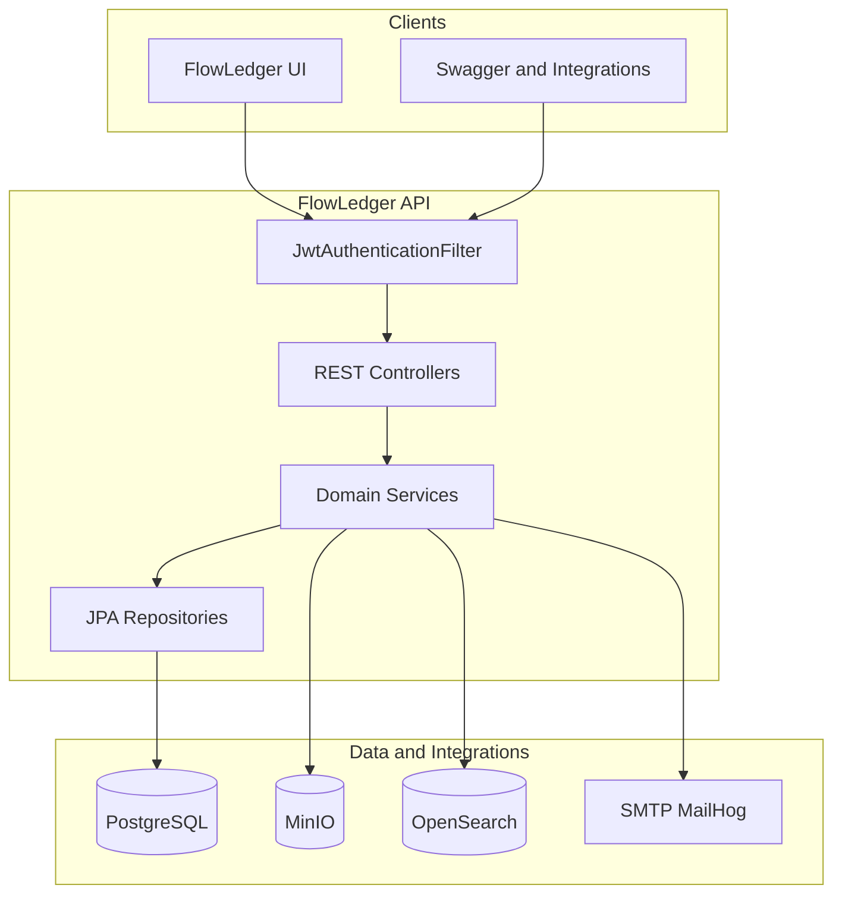
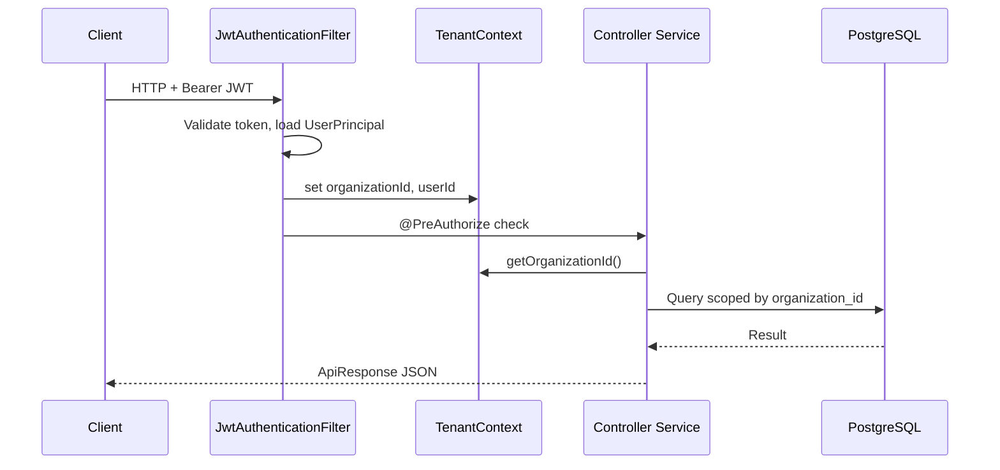
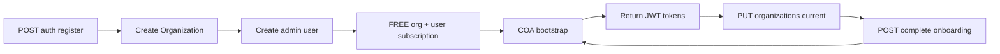
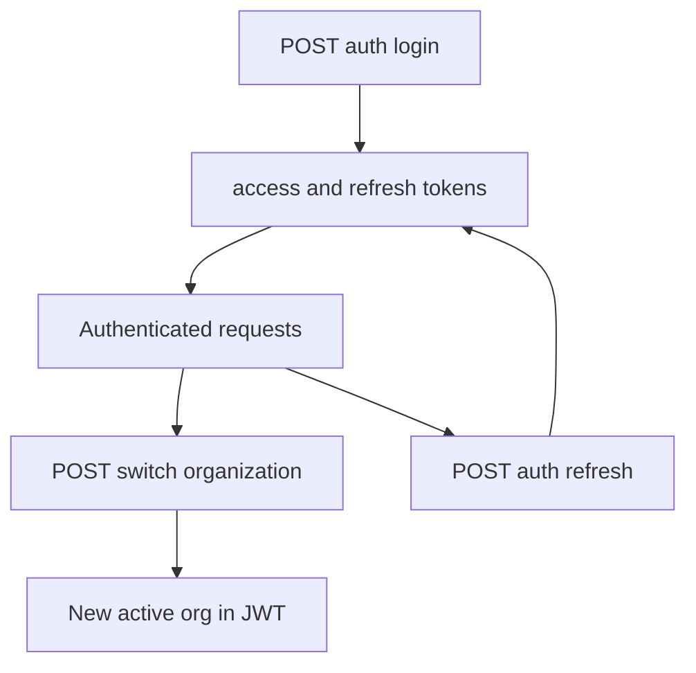
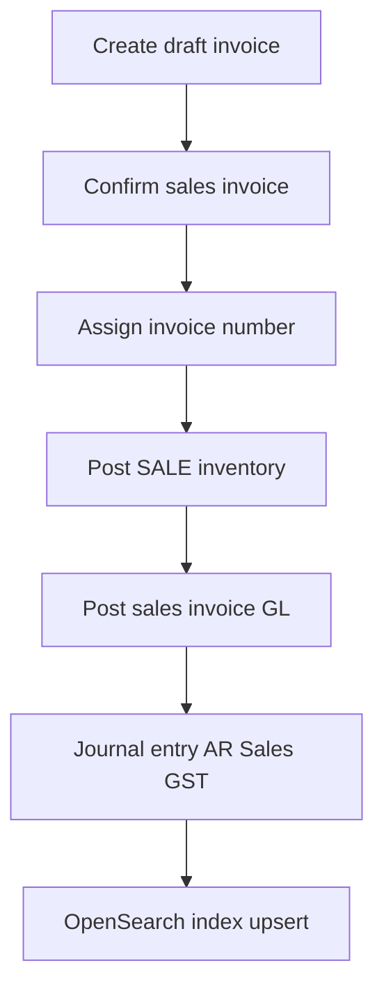
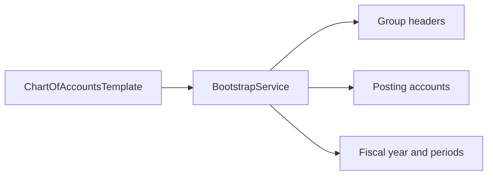

# FlowLedger API

Multi-tenant ERP backend for invoicing, inventory, sales, purchases, payments, and double-entry accounting. Every business record is scoped to an **organization**; the API enforces tenant isolation via JWT + `TenantContext`.

## Stack

| Layer | Technology |
|-------|------------|
| Runtime | Java 17+ |
| Framework | Spring Boot 3.4 |
| Security | Spring Security + JWT (access + refresh tokens) |
| Persistence | Spring Data JPA / Hibernate 6 |
| Database | PostgreSQL |
| Migrations | Flyway |
| Mapping | MapStruct, Lombok |
| Object storage | MinIO |
| Search | OpenSearch (derived index; PostgreSQL is source of truth) |
| PDF | OpenPDF, openhtmltopdf |
| API docs | springdoc OpenAPI |
| Tests | JUnit 5, Mockito (Testcontainers deps available) |

---

## Architecture

### High-level view



### Request pipeline



### Package layout

Domain-driven packages under `com.flowledger.*`. Each domain typically follows:

```
controller/ → service/ → repository/ → entity/
dto/        mapper/     domain/ (enums)
```

| Package | Responsibility |
|---------|----------------|
| `auth` | Login, register, refresh, password reset, invitations |
| `organization` | Org profile, onboarding, memberships, settings |
| `customer`, `supplier`, `product` | Master data |
| `warehouse`, `inventory` | Warehouses, stock ledger (append-only) |
| `sales` | Quotations, SO, challans, invoices, returns, credit notes |
| `purchase` | PO, GRN, purchase invoices, returns, debit notes |
| `payment` | Receipts, supplier payments, multi-line allocations, reminder rules |
| `accounting` | Chart of accounts, journals, ledgers, GST summary, reports |
| `tax` | GST calculation (intra/inter-state) |
| `template`, `pdf` | Invoice templates, PDF generation |
| `report`, `dashboard` | Business reports, KPIs |
| `lead`, `marketing`, `emailtemplate` | CRM, sequences, campaigns |
| `subscription` | Plans, org subscriptions, checkout, payment providers, usage limits |
| `search` | OpenSearch indexing & global search |
| `notification`, `audit`, `storage` | Notifications, audit log, MinIO files |
| `ai` | Optional AI platform (chat, RAG, tools, recommendations, forecasts, workflow stubs). On by default locally (`flowledger.ai.enabled=true`); set `FLOWLEDGER_AI_ENABLED=false` to disable. See `docs/ai/` |
| `common` | Security, tenant context, exceptions, utilities |

**Cross-cutting (`common`):**

- `security/` — `SecurityConfig`, `JwtService`, `JwtAuthenticationFilter`
- `tenant/` — `TenantContext` (ThreadLocal org + user)
- `exception/` — `GlobalExceptionHandler`
- `util/` — `DocumentNumberService`, `FinancialYearUtil`

---

## Core flows

### 1. Registration & onboarding



| Step | Endpoint | What happens |
|------|----------|--------------|
| Register | `POST /api/v1/auth/register` | New org + admin user; `onboardingCompleted=false` |
| Update profile | `PUT /api/v1/organizations/current` | GSTIN, address, invoice prefixes, etc. |
| Complete onboarding | `POST /api/v1/organizations/current/complete-onboarding` | Validates required fields; sets `onboardingCompleted=true`; re-runs COA bootstrap (idempotent) |

**Key files:** `AuthService.java`, `OrganizationService.java`, `ChartOfAccountsBootstrapService.java`

### 2. Authentication & multi-org



- JWT carries **active organization**; never accept `organizationId` from request body for scoping.
- **Team invites:** `POST /users/invite` → email with token → `POST /auth/accept-invitation`.
- Roles: `ORGANIZATION_ADMIN`, `ACCOUNTANT`, `SALES_MANAGER`, etc. (seeded in V7).

### 3. Sales invoice → inventory → GL



**Journal lines (simplified):**

| Account | Debit | Credit |
|---------|-------|--------|
| Accounts Receivable | Grand total | |
| Sales | | Taxable amount |
| Output CGST / SGST / IGST | | Tax amounts |

Similar auto-posting exists for purchase invoices, payments, returns, and credit/debit notes.

**Key files:** `SalesInvoiceService.java`, `InventoryService.java`, `AccountingPostingService.java`

### 4. Chart of accounts bootstrap

Triggered idempotently from:

1. Org registration (`AuthService.bootstrapAccounting`)
2. Onboarding complete (`OrganizationService`)
3. Lazy init on first GL posting (`AccountingPostingService.ensureInitialized`)



- **Template:** `accounting/bootstrap/ChartOfAccountsTemplate.java` — single source of truth.
- **Hierarchy:** V25 adds `description`, `status`, `is_editable`, `is_deletable`, parent links.
- **Demo seed:** V22–V24 (YRV Solutions), V26 (COA descriptions + custom accounts).

### 5. Inventory model

- **Append-only** `inventory_transactions` with idempotency keys.
- Stock is derived from movements; draft invoices may **reserve** quantity without reducing on-hand until confirm.
- Events: `OPENING_STOCK`, `PURCHASE`, `SALE`, `ADJUSTMENT`, `TRANSFER`.

### 6. Document numbering

- Pessimistic lock on `document_sequences` per org + document type + financial year.
- Format configurable per org (e.g. `{PREFIX}/{FY}/{SEQ:6}` → `INV/2026-27/000001`).

### 7. Global search

- PostgreSQL = source of truth; OpenSearch = rebuildable derived index.
- Indexed after commit: products, customers, suppliers, sales/purchase invoices.
- Reindex: `POST /api/v1/search/reindex` (admin, org from JWT).

---

## Database migrations (Flyway)

Location: `src/main/resources/db/migration/`  
JPA: `ddl-auto: validate` (schema owned by Flyway)

| Version | Purpose |
|---------|---------|
| V1 | Auth, organizations, users, roles, permissions |
| V2 | Master data (customers, suppliers, products, tax) |
| V3 | Inventory (warehouses, transactions) |
| V4 | Sales documents |
| V5 | Purchase documents |
| V6 | Payments, templates, audit |
| V7 | Seed roles, permissions, units |
| V8–V18 | Audit fixes, onboarding, memberships, marketing, notifications |
| V19 | Accounting core (accounts, fiscal years, journals) |
| V20–V21 | Document accounting hooks, journal line audit |
| V22–V24 | YRV Solutions demo seed |
| V25 | COA enhancements (hierarchy, status, flags) |
| V26 | YRV COA demo enrichment |
| V27–V31 | Later incremental features (see migration files) |
| V32 | Subscription billing extension (org subscriptions, payment transactions, webhooks) |

### Flyway policy

- **Never edit an already-applied migration** in shared/prod environments (V1–V31 and beyond once applied). Flyway checksum validation will fail on startup.
- **Unreleased local-only** migrations may be fixed in place before they are applied anywhere else.
- Otherwise use **forward-only** new versions (`V33+`).

---

## Subscriptions & billing

Organization subscription is the **source of truth** for plan limits (users/org, invoices/month, etc.).

| Endpoint prefix | Purpose |
|-----------------|---------|
| `/api/v1/subscriptions/plans` | List active plans |
| `/api/v1/subscriptions/current` | Current org subscription |
| `/api/v1/subscriptions/checkout` | Start paid checkout (or activate FREE) |
| `/api/v1/subscriptions/upgrade` | Upgrade path |
| `/api/v1/subscriptions/cancel` | Stop auto-renew |
| `/api/v1/subscriptions/verify-payment` | Client-side payment confirmation |
| `/api/v1/subscriptions/usage` | Usage vs plan limits |
| `/api/v1/subscriptions/invoices` | Subscription invoices |
| `/api/v1/subscriptions/webhooks/{provider}` | Provider webhooks (`razorpay`, `stripe`, `cashfree`, `paypal`) — `permitAll` |
| `/api/v1/billing/current` | Legacy billing view (org plan preferred) |

**Providers** (`flowledger.billing.provider`): `razorpay` (default), `stripe`, `cashfree`, `paypal`.  
When API keys are blank, providers return **dev mock order ids** and accept signatures locally (same pattern as Razorpay).

Config keys: `FLOWLEDGER_BILLING_PROVIDER`, `RAZORPAY_*`, `STRIPE_*`, `CASHFREE_*`, `PAYPAL_*` (see `application.yml`).

### Dual model / `user_subscriptions` deprecation

- `organization_subscriptions` is SoT for plan enforcement when present.
- `user_subscriptions` remains for soak/back-compat (`UserSubscription` is `@Deprecated`); **table is not dropped yet**.
- Registration creates both a FREE user subscription and a FREE org subscription.
- After soak, a future migration may drop `user_subscriptions`.

---

## AR payments

`/api/v1/payments` supports:

- Server-side list filters: `type`, `partyType`, `status`, `customerId`, `supplierId`, `from`, `to`, `search`
- Multi-line allocations on create and `POST /{id}/allocations` (list of `documentId` + `amount`)
- Get response includes `allocatedAmount`, `unallocatedAmount`, and allocation lines
- `POST /{id}/cancel` reverses allocations and accounting

---

## Quick start

### Prerequisites

- Java 17+
- PostgreSQL (`localhost:5432`, database `flowledger`, user/pass `flowledger`/`flowledger`)
- MinIO (`localhost:19000`) for logos and file storage
- Docker (optional) for MailHog + OpenSearch

### Run

```bash
# Optional: MailHog + OpenSearch
docker compose up -d

# Start API
mvn spring-boot:run
```

| Service | URL |
|---------|-----|
| API | http://localhost:7070 |
| Swagger UI | http://localhost:7070/swagger-ui.html |
| Actuator health | http://localhost:7070/actuator/health |
| MailHog UI | http://localhost:8025 |
| OpenSearch | https://localhost:19200 |

### Demo login (YRV seed)

If V22 seed ran: `kashyap221@gmail.com` / `passwor123d`

---

## Configuration

Environment variables (see `src/main/resources/application.yml`):

| Variable | Default | Purpose |
|----------|---------|---------|
| `JWT_SECRET` | (in yml) | HS256 signing key |
| `FRONTEND_URL` | production URL | Password reset & invite links |
| `PUBLIC_API_URL` | production URL | Public API base |
| `MINIO_ENDPOINT` | `http://localhost:19000` | Object storage |
| `MINIO_ACCESS_KEY` / `MINIO_SECRET_KEY` | | MinIO credentials |
| `MINIO_BUCKET` | `flowledger` | Storage bucket |
| `FLOWLEDGER_SEARCH_ENABLED` | `true` | Toggle OpenSearch |
| `FLOWLEDGER_SEARCH_URL` | `https://localhost:19200` | OpenSearch endpoint |
| `FLOWLEDGER_SEARCH_INDEX` | `flowledger-global-search-v1` | Index name |
| `FLOWLEDGER_SEARCH_USERNAME` / `PASSWORD` | | OpenSearch auth |
| `FLOWLEDGER_SEARCH_SSL_VERIFY` | `false` | TLS verify (local dev) |
| `FLOWLEDGER_EMAIL_ENABLED` | `true` | SMTP vs mock |
| `FLOWLEDGER_EMAIL_FROM` | | From address |
| `FLOWLEDGER_AI_ENABLED` | `true` | Master AI platform toggle |
| `FLOWLEDGER_AI_PROVIDER` | `OPENAI` | Provider key |
| `OPENAI_API_KEY` | | OpenAI API key (when AI enabled) |
| `OPENAI_BASE_URL` | `https://api.openai.com/v1` | OpenAI-compatible base URL |

**Datasource (default):** `jdbc:postgresql://localhost:5432/flowledger`  
**Server port:** `7070`  
**CORS:** `localhost:5173`, `localhost:3000`, production domains

---

## API surface (summary)

| Prefix | Domain |
|--------|--------|
| `/api/v1/auth` | Login, register, refresh, invitations |
| `/api/v1/organizations` | Org profile, onboarding |
| `/api/v1/users`, `/roles` | Team, RBAC |
| `/api/v1/customers`, `suppliers`, `products`, `categories`, `units`, `tax-rates` | Masters |
| `/api/v1/warehouses`, `/inventory` | Inventory |
| `/api/v1/sales`, `/purchases` | Sales & purchase documents |
| `/api/v1/payments` | Receipts & supplier payments (filters, multi-line allocate, cancel) |
| `/api/v1/accounting` | COA, journals, ledgers, reports |
| `/api/v1/dashboard`, `/reports` | KPIs & reports |
| `/api/v1/leads`, `/marketing` | CRM & campaigns |
| `/api/v1/billing` | Legacy subscription & usage |
| `/api/v1/subscriptions` | Plans, checkout, upgrade, webhooks, usage |
| `/api/v1/search` | Global search |
| `/api/v1/ai` | AI chat, recommendations, knowledge, analytics, workflow stubs (when enabled) |
| `/api/v1/audit-logs` | Audit trail |

### AI platform (optional)

Enabled by default (`FLOWLEDGER_AI_ENABLED` / `flowledger.ai.enabled=true`). Set to `false` to unload AI beans/routes. LangChain4j 0.36.2.

| Concern | Detail |
|---------|--------|
| Toggle | `@ConditionalOnAiEnabled` — beans absent when off |
| Tools vs RAG | Tools call ERP domain services; RAG uses knowledge docs + embeddings |
| Recommendations | Heuristics (`INVENTORY_RISK`, …); statuses NEW / ACKNOWLEDGED / DISMISSED |
| Events | `AiSearchEventBridge` listens to search upsert/delete **AFTER_COMMIT** |
| Analytics | `GET /api/v1/ai/analytics/forecasts?type=` gated by `analytics-enabled` (default false) |
| Docs | [`docs/ai/ROADMAP.md`](docs/ai/ROADMAP.md), Architecture, Sequence, OpenAPI, Flows |

Roadmap phases 1–8 are implemented; v2 covers streaming, real tool-calling agents, OCR/voice.

---

## Tests

```bash
mvn test
```

Unit tests under `src/test/java/com/flowledger/` — Mockito-based; focus on accounting, GST, search, PDF, utilities, and AI (chat, recommendations, event bridge).

Docs: `docs/ai/` (ROADMAP, ARCHITECTURE, SEQUENCE, OPENAPI, FLOWS).

---

## Related project

**FlowLedger UI** — React SPA at `../FlowLedgerUI`. Point `VITE_API_BASE_URL` to `http://localhost:7070/api/v1`.
