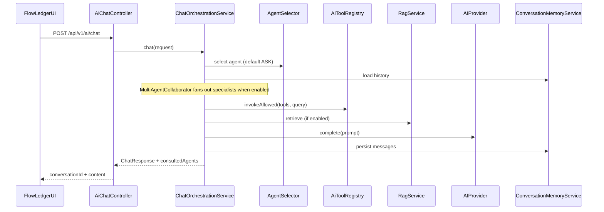
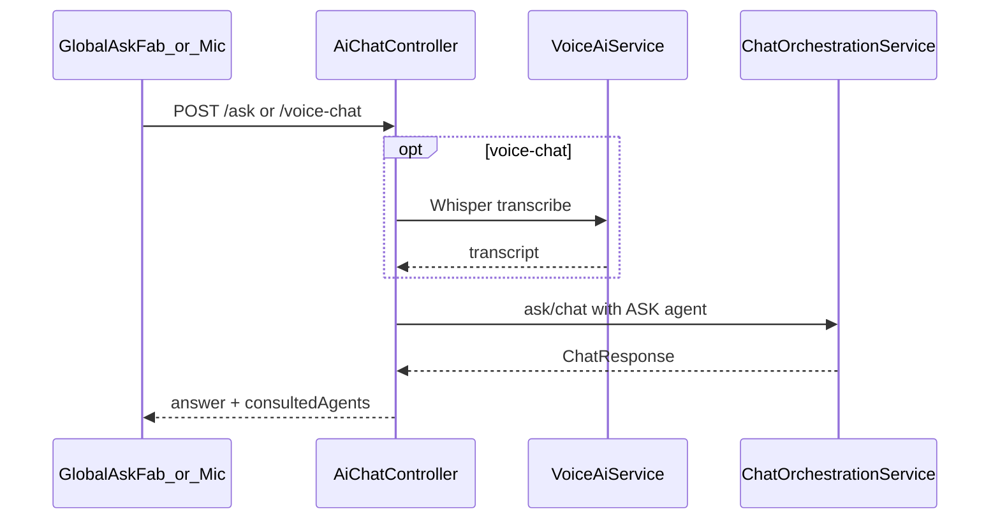
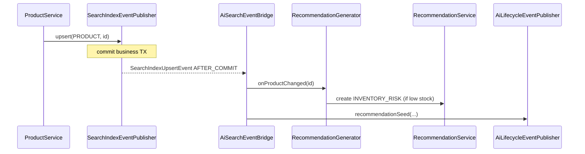
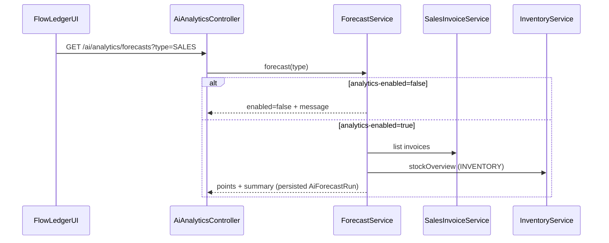

# FlowLedger AI — Sequence diagrams

## Chat

```mermaid
sequenceDiagram
  participant UI as FlowLedgerUI
  participant API as AiChatController
  participant Orch as ChatOrchestrationService
  participant Agent as AgentSelector
  participant Tools as AiToolRegistry
  participant RAG as RagService
  participant LLM as AIProvider
  participant Mem as ConversationMemoryService

  UI->>API: POST /api/v1/ai/chat
  API->>Orch: chat(request)
  Orch->>Agent: select agent (default ASK)
  Orch->>Mem: load history
  Note over Orch: MultiAgentCollaborator fans out specialists when enabled
  Orch->>Tools: invokeAllowed(tools, query)
  Orch->>RAG: retrieve (if enabled)
  Orch->>LLM: complete(prompt)
  Orch->>Mem: persist messages
  Orch-->>API: ChatResponse + consultedAgents
  API-->>UI: conversationId + content
```

## Global Ask / Voice

```mermaid
sequenceDiagram
  participant UI as GlobalAskFab_or_Mic
  participant API as AiChatController
  participant Voice as VoiceAiService
  participant Orch as ChatOrchestrationService

  UI->>API: POST /ask or /voice-chat
  opt voice-chat
    API->>Voice: Whisper transcribe
    Voice-->>API: transcript
  end
  API->>Orch: ask/chat with ASK agent
  Orch-->>API: ChatResponse
  API-->>UI: answer + consultedAgents
```

## Recommendation seed (event-driven)

```mermaid
sequenceDiagram
  participant ERP as ProductService
  participant Pub as SearchIndexEventPublisher
  participant Bridge as AiSearchEventBridge
  participant Gen as RecommendationGenerator
  participant Rec as RecommendationService
  participant Life as AiLifecycleEventPublisher

  ERP->>Pub: upsert(PRODUCT, id)
  Note over Pub: commit business TX
  Pub-->>Bridge: SearchIndexUpsertEvent AFTER_COMMIT
  Bridge->>Gen: onProductChanged(id)
  Gen->>Rec: create INVENTORY_RISK (if low stock)
  Bridge->>Life: recommendationSeed(...)
```

## Forecast

```mermaid
sequenceDiagram
  participant UI as FlowLedgerUI
  participant API as AiAnalyticsController
  participant F as ForecastService
  participant Sales as SalesInvoiceService
  participant Inv as InventoryService

  UI->>API: GET /ai/analytics/forecasts?type=SALES
  API->>F: forecast(type)
  alt analytics-enabled=false
    F-->>API: enabled=false + message
  else analytics-enabled=true
    F->>Sales: list invoices
    F->>Inv: stockOverview (INVENTORY)
    F-->>API: points + summary (persisted AiForecastRun)
  end
```
