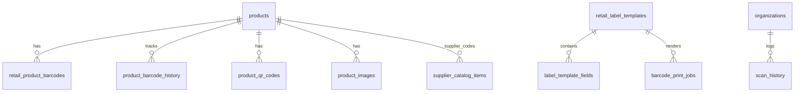

# Barcode & Product Identification Module

Master specification for FlowLedger's barcode, QR, labeling, supplier mapping, and scanning capabilities.

## Phased delivery

| Sprint | Scope | Status |
|--------|-------|--------|
| 1 | Scanner framework, `POST /scan/resolve`, `POST /cart/scan`, POS integration | Shipped |
| 2 | Barcode schema evolution, history, product barcodes UI, supplier codes | Shipped |
| 3 | QR codes, product image gallery (MinIO) | Shipped |
| 4 | Label designer, print jobs, PDF render | Shipped (Java PDF first) |
| 5 | Import/export wizards, mobile camera, GRN label popup, permissions | Shipped |

## Architecture

- **Frontend scanner** (`FlowLedgerUI/src/lib/barcode/`) publishes `BARCODE_SCANNED` events only — no module imports.
- **`BarcodeResolveService`** is the single backend resolver (aliases, variant, product, supplier SKU, name/SKU fallback).
- **`CartScanService`** orchestrates resolve → allocate → `PosSaleService.addLine` for unified POS cart updates.
- **`POST /api/v1/retail/pos/scan`** remains unchanged for backward compatibility.

## Database (Flyway)

| Migration | Tables / changes |
|-----------|------------------|
| V62 | `scan_history` |
| V63 | `retail_product_barcodes` columns, `product_barcode_history`, `supplier_catalog_items.supplier_barcode` |
| V64 | `product_qr_codes`, `product_images` |
| V65 | `label_template_fields`, `barcode_print_jobs`, label template canvas fields |
| V66 | BARCODE permissions, `product_import_jobs` |

## API catalog

See [barcode-scanner.md](./barcode-scanner.md) for scanner integration. Key endpoints:

- `POST /api/v1/scan/resolve` — resolve barcode to product
- `GET /api/v1/scan/history` — paginated scan audit
- `POST /api/v1/cart/scan` — POS unified scan + add line
- `GET/POST /api/v1/products/{id}/barcodes` — barcode management
- `POST /api/v1/products/{id}/barcode/generate|regenerate`
- `GET /api/v1/products/{id}/barcode-history`
- `GET/POST /api/v1/products/{id}/qr`, `/images`
- `GET/POST /api/v1/labels/templates`, `POST /labels/render`, `POST /products/barcodes/print`
- `POST /api/v1/products/import/preview`, `GET /products/barcodes/export`

## Permissions

| Permission | Purpose |
|------------|---------|
| `BARCODE_READ` | View barcodes, scan history |
| `BARCODE_WRITE` | Generate, regenerate, manage templates |
| `BARCODE_PRINT` | Queue label print jobs |

## ERD (target)

## Deferred

- GS1-128 encoder
- Go PDF microservice adapter
- Redis hot-barcode cache
- Full offline sync (IndexedDB queue interface only on frontend)
- Manufacturing auto-labels (MRP module stub)
