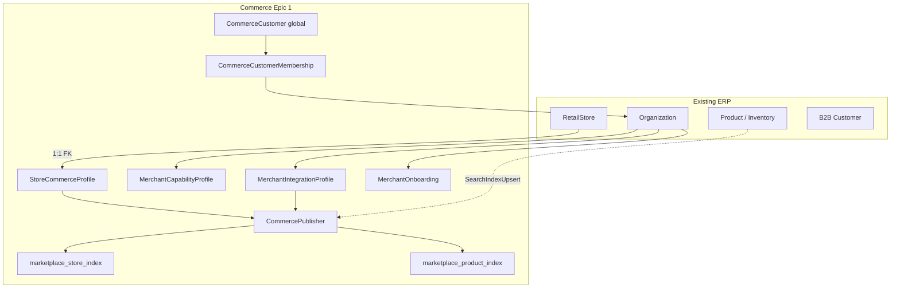
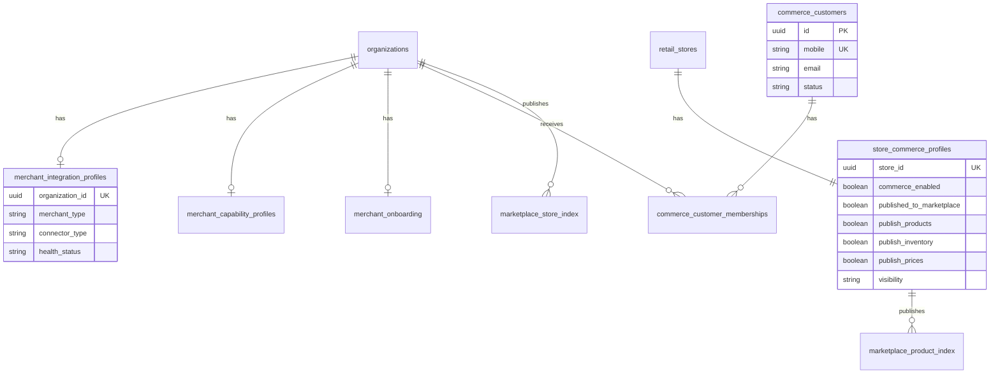
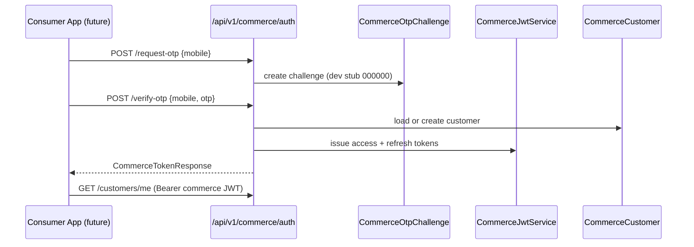
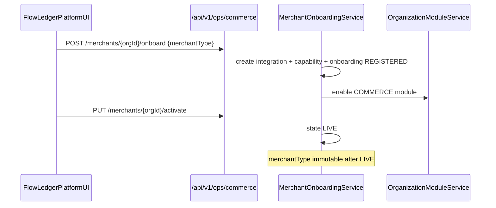
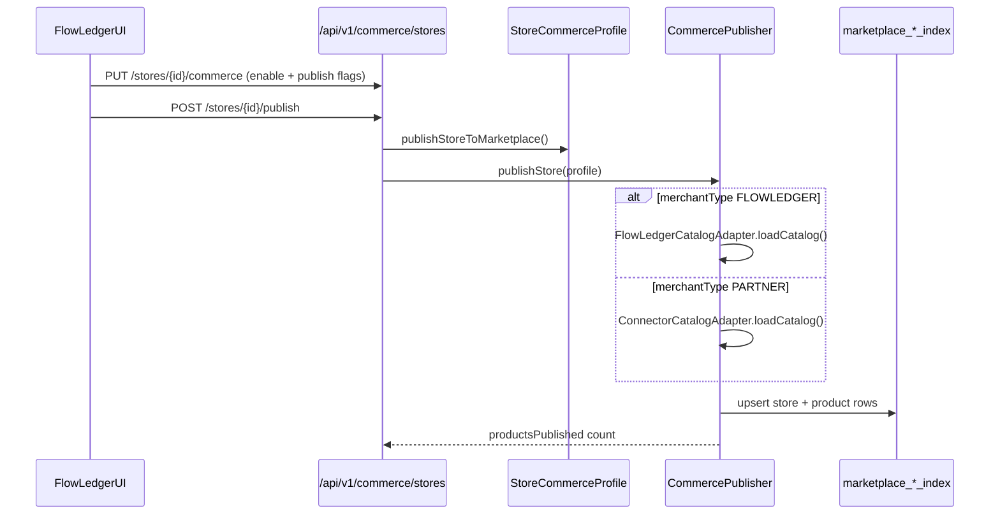

# Commerce Epic 1 — Foundation Architecture

Commerce Epic 1 introduces a bounded context inside FlowLedgerAPI that lets retail stores participate in digital commerce and marketplace publication **without modifying ERP core entities** (`RetailStore`, B2B `Customer`). Configuration lives in commerce-specific profiles; marketplace discovery reads normalized index tables only.

## Goals

- Enable per-store commerce configuration via `StoreCommerceProfile`
- Separate **commerce enablement** from **marketplace publication**
- Support FlowLedger-native (`FLOWLEDGER`) and partner (`PARTNER`) merchants through one `CommercePublisher` pipeline
- Provide platform ops APIs and tenant admin APIs; consumer auth APIs only (no consumer UI in Epic 1)

## Bounded context



### Design rules

| Rule | Rationale |
|------|-----------|
| Never duplicate ERP entities | Commerce extends via profiles and memberships |
| `StoreCommerceProfile` owns store commerce flags | Prevents drift with `RetailStore` POS fields |
| `commerceEnabled` ≠ `publishedToMarketplace` | Internal digital orders vs public discoverability |
| `CommerceCustomer` is global | One identity across merchants; org link via membership |
| Marketplace queries index tables only | Source-agnostic Epic 2 search |
| `merchantType` selects catalog adapter | ERP vs partner connector projection |

## Entity relationship (Epic 1 tables)



## Package layout

```
com.flowledger.commerce/
  auth/           Commerce JWT, OTP stub
  customer/       CommerceCustomer, memberships, addresses
  merchant/       MerchantType
  onboarding/     Merchant + customer state machines
  integration/    MerchantIntegrationProfile
  capability/     MerchantCapabilityProfile
  store/          StoreCommerceProfile
  publisher/      CommercePublisher, catalog adapters, index entities
  events/         Domain events + CommerceCatalogEventBridge
  scheduler/      MerchantIntegrationHealthScheduler
  api/            Tenant + auth REST controllers
  service/        Application services
  config/         CommerceModuleGuard, properties

com.flowledger.ops/
  OpsCommerceController, OpsCommerceService   (platform cross-tenant)
```

## StoreCommerceProfile — two concerns

| Concern | Fields | Meaning |
|---------|--------|---------|
| Enablement | `commerceEnabled`, `supports*`, `acceptOnlineOrders` | Store accepts digital fulfillment channels |
| Publication | `publishedToMarketplace`, `publishProducts/Inventory/Prices`, `visibility` | Store/catalog discoverable in marketplace |

Publication triggers `CommercePublisher.publishStore()`, which writes `marketplace_store_index` and `marketplace_product_index` rows.

## Commerce authentication flow



Commerce JWT uses a dedicated secret (`flowledger.commerce.jwt`) and filter (`CommerceJwtAuthenticationFilter`). ERP user tokens are not accepted on commerce customer routes.

## Merchant onboarding flow (platform)



`merchantType` values:

- `FLOWLEDGER` — catalog from ERP products (`FlowLedgerCatalogAdapter`)
- `PARTNER` — catalog from connector JSON projection (`ConnectorCatalogAdapter`)

## Store publication flow



Incremental ERP product changes propagate via `CommerceCatalogEventBridge` listening to `SearchIndexUpsertEvent` (PRODUCT) and calling `CommercePublisher.publishCatalogItem()`.

## API surface

### Commerce auth (public)

| Method | Path | Notes |
|--------|------|-------|
| POST | `/api/v1/commerce/auth/request-otp` | Dev returns stub OTP |
| POST | `/api/v1/commerce/auth/verify-otp` | Issues commerce JWT |
| POST | `/api/v1/commerce/auth/refresh` | Refresh token |

### Tenant commerce (ERP JWT + COMMERCE module)

| Method | Path | Permission |
|--------|------|------------|
| GET | `/api/v1/commerce/merchant/profile` | COMMERCE_VIEW |
| PUT | `/api/v1/commerce/merchant/capabilities` | COMMERCE_CONFIG_WRITE |
| PUT | `/api/v1/commerce/merchant/integration` | COMMERCE_CONFIG_WRITE |
| GET/PUT | `/api/v1/commerce/stores/{id}/commerce` | COMMERCE_STORE_MANAGE |
| POST | `/api/v1/commerce/stores/{id}/publish` | COMMERCE_STORE_MANAGE |
| POST | `/api/v1/commerce/stores/{id}/unpublish` | COMMERCE_STORE_MANAGE |
| GET | `/api/v1/commerce/memberships` | COMMERCE_VIEW |

### Platform ops

| Method | Path | Permission |
|--------|------|------------|
| GET | `/api/v1/ops/commerce/merchants` | COMMERCE_OPS_READ |
| GET | `/api/v1/ops/commerce/merchants/{orgId}` | COMMERCE_OPS_READ |
| POST | `/api/v1/ops/commerce/merchants/{orgId}/onboard` | COMMERCE_OPS_WRITE |
| PUT | `/api/v1/ops/commerce/merchants/{orgId}/activate` | COMMERCE_OPS_WRITE |
| PUT | `/api/v1/ops/commerce/merchants/{orgId}/suspend` | COMMERCE_OPS_WRITE |
| GET | `/api/v1/ops/commerce/integrations/health` | COMMERCE_OPS_READ |

## UI split

| App | Routes | Responsibility |
|-----|--------|----------------|
| FlowLedgerPlatformUI | `/commerce/merchants`, `/commerce/integrations` | Cross-tenant onboard, activate/suspend, health |
| FlowLedgerUI | `/commerce/admin/*` | Capabilities, integration, store commerce, publish, memberships |

## Events

| Event | When |
|-------|------|
| `MerchantRegistered` | Platform onboard |
| `MerchantActivated` | State → LIVE |
| `StoreCommerceEnabled` | First enable on store profile |
| `StorePublished` / `StoreUnpublished` | Marketplace index changes |
| `CatalogItemPublished` | Incremental product index upsert |

## Future Maven extraction

Suggested modules for post-monolith split:

- `commerce-core` — entities, domain services, auth
- `commerce-marketplace` — publisher, index writers, Epic 2 search
- `commerce-connectors` — partner adapters, health scheduler

Epic 1 keeps all packages under `com.flowledger.commerce.*` with clear sub-packages to ease extraction.

## Out of scope (Epic 1)

Marketplace search UI, cart, checkout, orders, scan & go checkout, wallet, loyalty, promotions, and consumer-facing applications.
