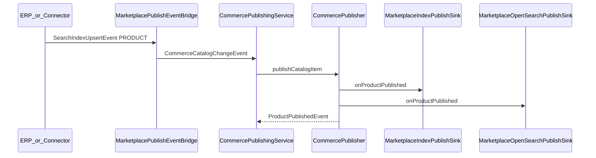

# Commerce Epic 2 — Marketplace & Publishing

Epic 2 adds **marketplace discovery** on top of the Epic 1 publication foundation. All consumer-facing marketplace APIs read dedicated index tables only — never ERP tables.

## Read models (V79)

| Table | Domain type | Purpose |
|-------|-------------|---------|
| `marketplace_store_index` (evolved) | `MarketplaceStore` | Geo discovery, services, visibility |
| `marketplace_product_index` (evolved) | `MarketplaceProduct` | SKU/barcode/GTIN search, prices, images |
| `marketplace_inventory_index` | `MarketplaceInventory` | Per-store inventory snapshots |
| `marketplace_category_index` | `MarketplaceCategory` | Category facets |
| `marketplace_brand_index` | `MarketplaceBrand` | Brand facets |
| `marketplace_sync_jobs` | — | Retry queue, idempotency |

Typed columns (`name`, `sku`, `barcode`, `lat`/`lng`, etc.) support Postgres search; JSONB `payload` retains display extras.

## Commerce Publishing Layer

ERP modules and partner connectors **never write marketplace tables directly**. Every product, inventory, price, and store change flows through a single publishing pipeline:

```
ERP Product / Store Change
        │
        ▼
MarketplacePublishEventBridge  →  CommerceCatalogChangeEvent
        │
        ▼
CommercePublishingService  (single entry point)
        │
        ▼
CommercePublisher  (orchestrator — builds normalized snapshots)
        │
        ├── MarketplaceIndexPublishSink     → PostgreSQL read models
        ├── MarketplaceOpenSearchPublishSink → OpenSearch marketplace index
        ├── RecommendationPublishSink       → (future)
        └── AnalyticsPublishSink            → (future)
```

`CommercePublisher` fans out `StorePublishedSnapshot`, `ProductPublishedSnapshot`, `CategoryPublishedSnapshot`, and `BrandPublishedSnapshot` to every `CommercePublishSink`. Idempotency uses `content_hash` on PG index rows.

## Publishing pipeline



**FlowLedger merchants:** `FlowLedgerCatalogAdapter` reads ERP products, categories, images (presigned URLs via `MarketplaceImagePublisher`).

**Partner merchants:** `ConnectorCatalogAdapter` reads `configurationJson.catalog[]`.

## Auto-publish

When `StoreCommerceService.update()` sets both `commerceEnabled` and `publishedToMarketplace` (or publish toggles change), `MarketplaceSyncService.syncStore(FULL)` runs automatically.

## Search infrastructure

```
MarketplaceSearchService
  └── MarketplaceSearchBackend
        ├── OpenSearchMarketplaceSearchBackend (default, uses core OpenSearchClientHolder)
        └── PostgresMarketplaceSearchBackend (fallback when OpenSearch unavailable)
```

Marketplace search uses a **dedicated index** (`flowledger-marketplace-search-v1`) separate from the ERP global search index. Switch backends via `flowledger.commerce.marketplace.search.backend` without API changes.

## Barcode lookup

```
GET /api/v1/commerce/marketplace/barcode/{barcode}?lat=&lng=&radiusKm=
```

1. Query `marketplace_product_index` by barcode/GTIN
2. Find stores via `marketplace_inventory_index` + store geo
3. Return product summary + ranked nearby stores (distance, price, qty)

Does **not** use ERP `BarcodeResolveService`.

## Public APIs (read-only)

| Method | Path |
|--------|------|
| GET | `/api/v1/commerce/marketplace/stores` |
| GET | `/api/v1/commerce/marketplace/stores/{id}` |
| GET | `/api/v1/commerce/marketplace/products` |
| GET | `/api/v1/commerce/marketplace/products/{id}` |
| GET | `/api/v1/commerce/marketplace/barcode/{barcode}` |
| GET | `/api/v1/commerce/marketplace/categories` |
| GET | `/api/v1/commerce/marketplace/brands` |

Security: `permitAll()` on GET marketplace routes.

DTOs omit `organizationId` and `merchantType` (source-agnostic).

## Events

| Event | When |
|-------|------|
| `StorePublished` / `StoreUnpublished` | Store marketplace publish/unpublish |
| `ProductPublished` / `ProductUnpublished` | Product index upsert/remove |
| `InventoryPublished` | Inventory-only update |
| `PricePublished` | Price-only update |
| `CategoryPublished` | Category facet update |
| `PartnerCatalogSynced` | Partner connector full sync |
| `CommerceCatalogChangeEvent` | Internal commerce-layer change (PRODUCT_UPSERT, etc.) |

## Configuration

```yaml
flowledger:
  commerce:
    marketplace:
      search:
        backend: opensearch   # opensearch | postgres
        index: flowledger-marketplace-search-v1
      image-url-ttl-minutes: 1440
      sync:
        max-retries: 5
        batch-size: 100
        poll-interval-ms: 60000
```

## Out of scope

Carts, checkout, orders, payments, consumer UI.
