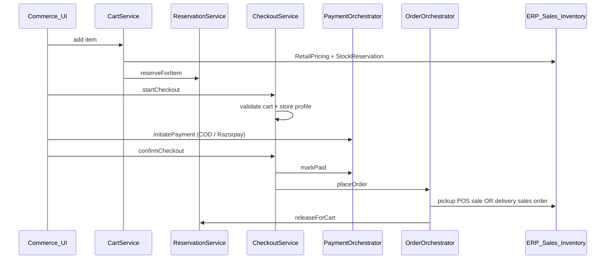

# Commerce Epic 3 — Cart, Checkout & Orders

Epic 3 delivers the **full customer purchase journey** on top of Epic 1 (commerce identity) and Epic 2 (marketplace discovery). ERP pricing, tax, inventory, and sales documents remain the source of truth — commerce orchestrates them via tenant-scoped bridges.

## Schema (V80)

| Table | Purpose |
|-------|---------|
| `commerce_carts` / `commerce_cart_items` | One active cart per `(customer, store)` with line snapshots |
| `commerce_inventory_reservations` | Maps cart lines → ERP `stock_reservations` (`referenceType=COMMERCE_CART`) |
| `commerce_checkout_sessions` | Priced checkout with fulfillment, address, coupon |
| `commerce_orders` / `commerce_order_lines` | Customer-facing order + ERP document links |
| `commerce_payment_sessions` | COD or gateway payment state |
| `commerce_coupon_redemptions` | Coupon audit trail |

## Flow overview



## REST APIs

All cart/checkout/order routes require `COMMERCE_CUSTOMER` JWT (OTP auth from Epic 1). Marketplace browse remains public.

| Method | Path | Description |
|--------|------|-------------|
| POST | `/api/v1/commerce/carts` | Get or create active cart for store |
| GET | `/api/v1/commerce/carts/active?storeId=` | Active cart shortcut |
| POST | `/api/v1/commerce/carts/{id}/items` | Add/update line (reserves stock) |
| PATCH | `/api/v1/commerce/carts/{id}/items/{itemId}` | Change quantity |
| DELETE | `/api/v1/commerce/carts/{id}/items/{itemId}` | Remove line |
| POST | `/api/v1/commerce/checkout/sessions` | Start checkout |
| GET | `/api/v1/commerce/checkout/sessions/{id}` | Checkout snapshot |
| POST | `/api/v1/commerce/checkout/sessions/{id}/coupon` | Apply coupon |
| POST | `/api/v1/commerce/checkout/sessions/{id}/pay` | Initiate payment |
| POST | `/api/v1/commerce/checkout/sessions/{id}/confirm` | Confirm (COD or verified online) |
| GET | `/api/v1/commerce/orders` | Order history |
| GET | `/api/v1/commerce/orders/{id}` | Order detail |
| POST | `/api/v1/commerce/payments/webhooks/{provider}` | Gateway webhooks (`permitAll`) |

## Key design decisions

- **Reserve on add-to-cart** — inventory held via ERP `StockReservationService`; TTL from `flowledger.commerce.cart.reservation-ttl-minutes`.
- **Pricing/tax** — `CommercePricingService` delegates to `RetailPricingService` + `TaxLineCalculator` (no duplicate ERP logic).
- **Customer bridge** — `CommerceCustomerBridgeService` find-or-creates ERP `Customer` with code `COMM-{mobile}`.
- **Fulfillment**
  - Pickup / click & collect → draft invoice → POS confirm → post sale
  - Home delivery → sales order → confirm → convert to invoice
- **Payments** — COD path on confirm; Razorpay via `PaymentProviderRegistry` + webhook completion.
- **Events** — `CartCreatedEvent`, `CommerceOrderPlacedEvent`, `CommerceReservationExpiredEvent`.

## Configuration

```yaml
flowledger:
  commerce:
    cart:
      reservation-ttl-minutes: 15
      renewal-extension-minutes: 15
      checkout-ttl-minutes: 30
      max-item-qty: 99
      reservation-poll-ms: 60000
      checkout-expiry-poll-ms: 120000
```

CORS includes `http://localhost:5175` for the reference UI.

## Reference UI

Consumer app lives in **`flowledger-commerce-ui`** (port **5175**), separate from ERP admin (`FlowLedgerUI`).

Journey: OTP login → store discovery → browse products → cart → checkout (fulfillment + COD) → order history → account/addresses.

## Out of scope (Epic 3)

Wallet, loyalty, AI recommendations, scan & go — planned for later epics.

## Local E2E smoke test

1. Start API + seed demo data with marketplace-enabled stores.
2. `cd flowledger-commerce-ui && npm install && npm run dev`
3. Login with demo mobile + OTP (`000000` when `dev-return-in-response: true`).
4. Browse marketplace → add to cart → checkout with COD → view order history.
