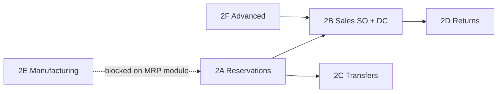
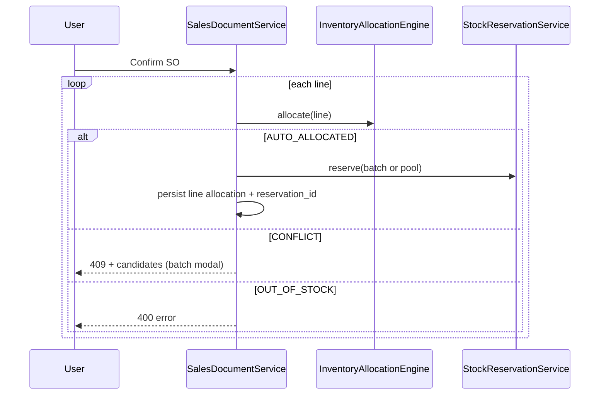

# Smart Inventory Allocation Engine — Phase 2 Plan

**Status:** Planned (not started)  
**Prerequisite:** [Phase 1 — POS](inventory-allocation.md) (complete)

Phase 2 extends the reusable `InventoryAllocationEngine` to long-running sales/purchase documents, warehouse transfers, and returns — with **batch-aware stock reservations** to replace Phase 1’s checkout-time re-validation for held inventory.

---

## Goals

1. **One engine, many modules** — SO, DC, invoice, transfer, returns call the same allocation API as POS.
2. **Reservations** — hold batch or warehouse-pool qty from confirm until consume/release.
3. **Respect org `inventory_deduction_event`** — reserve/deduct at the correct lifecycle step.
4. **Batch-tracked UX** — modal only on `CONFLICT`; silent on `AUTO_ALLOCATED`; error on `OUT_OF_STOCK`.
5. **Backward compatible** — non-batch products keep warehouse-pool behavior; existing orgs unaffected until batch tracking is enabled.

---

## Current codebase gaps (as of Phase 1)

| Area | Today | Phase 2 need |
|------|--------|--------------|
| `InventoryAllocationEngine` | POS scan + checkout revalidate | `reserve`, `release`, `consume`, document-line DTOs |
| `StockReservationService` | Product + warehouse only; no `batch_id` | Batch-aware reservations; link to allocated batch |
| `inventory_deduction_event` | Stored on org settings; only used in `ShipmentService.maybePostInventoryOnDispatch` | Central dispatcher for SO / DC / invoice / dispatch |
| `sales_order_items` | No allocation columns | Same as `pos_sale_lines` pattern |
| `delivery_challan_items` | No allocation columns | Per-line batch + reserved qty |
| `sales_invoice_items` | No allocation columns | Snapshot allocation at invoice |
| `InventoryService.transferStock` | Product-level only | Source batch selection + IN txn batch on receipt |
| Returns (sales/purchase) | Product-level `postTransaction` | Optional batch restore/deduct |
| Manufacturing | Module flag `COMING_SOON` | **Out of scope until MRP module exists** |
| NEAREST_WAREHOUSE | Not implemented | Phase 2F (optional) |

---

## Recommended sub-phases

Build in order — each sub-phase is independently shippable.



| Sub-phase | Scope | Est. relative size |
|-----------|--------|-------------------|
| **2A** | Reservations foundation + engine availability math | ~1× Phase 1 |
| **2B** | Sales orders + delivery challans + invoice consume | ~1.5× Phase 1 |
| **2C** | Warehouse transfers | ~0.5× Phase 1 |
| **2D** | Sales + purchase returns | ~0.75× Phase 1 |
| **2E** | Manufacturing consumption | Blocked — module not built |
| **2F** | Nearest warehouse, serial/lot/bin, cross-warehouse | ~1× Phase 1 (optional) |

**Suggested first slice:** **2A + 2B** (reservations + sales chain).

---

## Sub-phase 2A — Stock reservations foundation

### Schema (Flyway V58+)

**`stock_reservations`**

```sql
ALTER TABLE stock_reservations
  ADD COLUMN IF NOT EXISTS inventory_batch_id UUID REFERENCES inventory_batches(id),
  ADD COLUMN IF NOT EXISTS allocation_mode VARCHAR(20);

-- CHECK allocation_mode IN ('WAREHOUSE_POOL', 'BATCH_AUTO', 'BATCH_MANUAL') OR NULL
CREATE INDEX IF NOT EXISTS idx_stock_reservations_batch
  ON stock_reservations (organization_id, inventory_batch_id, status)
  WHERE inventory_batch_id IS NOT NULL;
```

Optional: `line_reference_id UUID` to tie reservation to a specific document line (SO line, DC line).

### Engine API extensions

```java
public interface InventoryAllocationEngine {
    // Phase 1 (existing)
    AllocationResult allocate(AllocationRequest request);
    AllocationResult allocateWithBatch(AllocationRequest request, UUID batchId);
    CheckoutValidationResult revalidateForCheckout(List<CartLineAllocation> cartLines);

    // Phase 2A
    ReservationResult reserveForDocument(DocumentLineAllocationRequest request);
    void releaseByReference(String referenceType, UUID referenceId);
    void consumeByReference(String referenceType, UUID referenceId);
    AllocationResult revalidateReservation(UUID reservationId);
}
```

**Availability math (critical):**

- **Warehouse pool:** `available = stockBalance − activeReservations(product, warehouse)` (exclude current document’s own reservations when revalidating).
- **Batch:** `available = batch.quantity − activeReservations(batchId)` (same exclusion rule).

Update `WarehousePoolAllocator` and `AllocationCandidateProvider` to subtract reserved qty (Phase 1 `InventoryMovementValidator` already subtracts product-level reservations — align engine with validator).

### Reservation lifecycle

| Event | Action |
|-------|--------|
| Document confirm (SO / DC per org setting) | `reserveForDocument` per line |
| Document cancel | `releaseByReference` |
| Invoice confirm / shipment dispatch (consume point) | `consumeByReference` + `postTransaction` with batch |
| Reservation TTL (`expires_at`) | Scheduled job → `EXPIRED` + release (optional 2A stretch) |

### POS (optional 2A tail)

- Held POS carts (`PosSaleStatus.HELD`) may create short-TTL reservations instead of checkout-only revalidation.
- Not required for 2B; improves concurrent counter accuracy.

### Tests

- Reserve warehouse pool → reduces available; release restores.
- Reserve batch → concurrent second reserve fails or gets CONFLICT.
- Consume transitions reservation to CONSUMED; stock posts once.

---

## Sub-phase 2B — Sales orders + delivery challans

### Inventory deduction event wiring

Org setting `inventory_deduction_event` (`INVOICE_CONFIRM` | `DELIVERY_CHALLAN` | `SALES_ORDER` | `CHALLAN_DISPATCH`):

| Setting | Reserve at | Consume / deduct at |
|---------|------------|---------------------|
| `SALES_ORDER` | SO confirm | Invoice confirm (or DC if configured) |
| `DELIVERY_CHALLAN` | DC create/confirm | Invoice confirm |
| `CHALLAN_DISPATCH` | Shipment dispatch (partial today) | Already posts in `ShipmentService` — add batch + reservations |
| `INVOICE_CONFIRM` | Optional soft check only | Invoice confirm (today’s default) |

Introduce **`InventoryDeductionCoordinator`** (single service) called from:

- `SalesDocumentService` (SO confirm, DC create/confirm, cancel)
- `SalesInvoiceService.confirm`
- `ShipmentService.maybePostInventoryOnDispatch`

Controllers/services **must not** duplicate allocation logic.

### Schema (Flyway V59+)

Add to **`sales_order_items`**, **`delivery_challan_items`**, **`sales_invoice_items`**:

```sql
inventory_batch_id UUID REFERENCES inventory_batches(id),
warehouse_id UUID REFERENCES warehouses(id),
allocation_mode VARCHAR(20),
stock_reservation_id UUID REFERENCES stock_reservations(id)  -- nullable
```

### Flow — sales order confirm



### Flow — delivery challan

- On DC create from SO: **copy** allocation from SO lines (same batch/reservation) or re-run engine if partial qty.
- Partial DC: split reservation qty or create child reservations (design choice — recommend **split reservation** with parent reference).

### Flow — invoice confirm

1. If reservations exist for SO/DC reference → `consumeByReference` + batch-aware `postTransaction`.
2. If no reservations (legacy invoice) → run engine allocate + post (same as Phase 1 POS path).
3. Idempotency keys unchanged pattern: `invoice:{id}:{lineId}`.

### API / UI

**API**

- SO/DC line create/update accepts `inventoryBatchId`, `allocationMode`, `warehouseId`.
- New endpoints (or extend existing):
  - `POST /sales/orders/{id}/lines/{lineId}/allocate` — re-run allocation
  - `POST /sales/orders/{id}/lines/{lineId}/allocate/confirm` — manual batch pick
  - Same pattern for challans

**UI** (`SalesOrderDetailPage`, `DeliveryChallanDetailPage`)

- Reuse `InventorySelectionModal` from POS (move to shared `features/inventory/`).
- Show batch badge on line when batch-tracked.
- On confirm SO → handle 409 like POS checkout.

### Tests

- SO confirm batch product → reservation created.
- DC partial → reservation qty split correctly.
- Invoice consumes reservation; no double deduct.
- Cancel SO → reservations released.

---

## Sub-phase 2C — Warehouse transfers

### Behavior

- **Non-batch:** allocate from source warehouse pool (respect reservations).
- **Batch:** engine picks source batch (strategy); destination warehouse receives IN with same `batch_number` / new batch row.
- **CONFLICT:** user picks source batch in modal.

### Schema

Optional `inventory_transfer_lines` table if transfers move from header-only to line-based document (today `InventoryDtos.Transfer` is single product/qty).

If keeping single-product API:

- Extend `Transfer` DTO: `inventoryBatchId`, `allocationMode`.
- Post OUT with batch; post IN with same batch metadata.

### Tests

- Transfer reduces source batch; creates/updates destination batch.
- Insufficient batch qty → OUT_OF_STOCK.

---

## Sub-phase 2D — Returns

### Sales return

- On confirm: IN stock to warehouse (existing).
- **Batch-tracked:** prefer restoring to **original invoice line batch** if recorded; else engine allocates “return bucket” or prompt user.
- Release/consume any dangling reservations on returned qty.

### Purchase return

- On confirm: OUT from warehouse/batch.
- Engine allocates batch to deduct (FEFO/FIFO of remaining supplier batches).

### Schema

Add allocation columns to `sales_return_items`, `purchase_return_items` (mirror sales invoice items).

---

## Sub-phase 2E — Manufacturing (blocked)

The platform module `MANUFACTURING` is `COMING_SOON` — no production orders or BOM consumption exist.

**When MRP lands:**

- Material issue on work order confirm → same `reserveForDocument` + consume on completion.
- Finished goods receipt → IN batch (like GRN Phase 1 wiring).

**Do not start 2E** until manufacturing entities and services exist.

---

## Sub-phase 2F — Advanced (optional)

| Feature | Requirement |
|---------|-------------|
| `NEAREST_WAREHOUSE` strategy | Warehouse priority / branch mapping table; stub exists in enum as Phase 2 |
| Cross-warehouse allocation | Engine searches eligible batches across warehouses; line may split (explicitly out of Phase 1) |
| Serial numbers | Allocate specific serial; extend `AllocationCandidate.serialNumber` |
| Lot / bin | `bin_location` on batches; filter in `AllocationCandidateProvider` |
| Partial multi-batch line | One line fulfilled from multiple batches — needs line-split or allocation children table |

Recommend **deferring 2F** until 2A–2D are stable in production.

---

## Shared components to extract (avoid duplication)

| Component | Location |
|-----------|----------|
| `InventorySelectionModal` | Move `FlowLedgerUI/src/features/retail/` → `features/inventory/` |
| `AllocationConflictHandler` | Shared axios 409 parser (extend `getPosCheckoutConflict` → generic) |
| `InventoryDeductionCoordinator` | New API service |
| `DocumentLineAllocation` record | Parallel to `CartLineAllocation` |

---

## Migration & rollout

1. **Flyway** V58 (reservations) → V59 (sales line columns) → V60 (returns) as needed.
2. **Feature flag** (optional): `organization_settings.allocation_engine_v2_enabled` default `true` for new orgs, `false` for existing until tested.
3. **Backfill:** Existing open SO/DC lines get `allocation_mode = WAREHOUSE_POOL`, null batch — engine runs on next confirm.
4. **Docs:** Update `inventory-allocation.md` Phase 2 section with links to this doc.

---

## Risks

| Risk | Mitigation |
|------|------------|
| Double reservation (SO + DC) | Single coordinator; idempotent reserve by `(reference_type, reference_id, line_id)` |
| `inventory_deduction_event` inconsistency | One coordinator; unit tests per event value |
| Partial fulfillment complexity | Explicit reservation split model in 2B design doc before coding |
| Manufacturing blocked | Keep 2E in plan but don’t estimate sprint time |
| Performance (batch queries per line) | Batch-load eligible batches per product+warehouse in one query (already pattern in Phase 1) |

---

## Test matrix (Phase 2 total)

| Area | Tests |
|------|-------|
| 2A | Reservation CRUD, availability math, batch vs pool |
| 2B | SO/DC/invoice lifecycle, deduction event matrix, 409 conflict |
| 2C | Transfer batch OUT/IN |
| 2D | Return restore/deduct batch |
| Integration | MockMvc per module; one end-to-end SO→DC→invoice scenario |

---

## Out of scope (unchanged from Phase 1 plan)

- Editing the original Phase 1 plan file
- POS rewrite (Phase 1 stands; optional reservation upgrade in 2A)
- Full manufacturing (2E blocked)
- Multi-warehouse line splits (2F)

---

## Next step

When ready to implement, start **2A (reservations)** then **2B (sales chain)**. Confirm with stakeholders whether `SALES_ORDER` or `INVOICE_CONFIRM` is the primary deduction event for your deployments — it drives 2B coordinator design.
