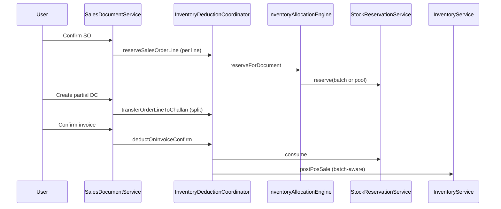

# Smart Inventory Allocation Engine — Phase 2 (2A + 2B)

**Status:** Implemented (2A + 2B)  
**Prerequisite:** [Phase 1 — POS](inventory-allocation.md) (complete)  
**Schema:** [Database ERD](inventory-allocation-schema.md)

Phase 2A–2B extend the reusable `InventoryAllocationEngine` to the sales order → delivery challan → invoice chain with **batch-aware stock reservations** and org-level `inventory_deduction_event` overrides via a single coordinator.

Deferred: **2C** transfers, **2D** returns, **2E** manufacturing (module `COMING_SOON`), **2F** advanced (bin/serial/nearest warehouse).

---

## Locked inventory lifecycle (default)

| Event | Reserve | Deduct (ledger) |
|-------|---------|-----------------|
| **Sales order confirm** | Yes | No |
| **Delivery challan** | Existing reservations stay or split | No |
| **Shipment dispatch** | Optional (org override) | Optional (org override) |
| **Invoice confirm** | Consume reservation | Yes (batch-aware) |

**Availability:** `available = onHand − activeReservedQty` (warehouse pool or batch).

---

## Org override — `InventoryDeductionCoordinator`

Single service interprets `OrganizationSettings.inventoryDeductionEvent`:

| Setting | Reserve at | Consume + deduct at |
|---------|------------|---------------------|
| `SALES_ORDER` (2B default) | SO confirm | Invoice confirm |
| `INVOICE_CONFIRM` (legacy) | Invoice confirm | Invoice confirm |
| `DELIVERY_CHALLAN` | DC create/confirm | Invoice confirm |
| `CHALLAN_DISPATCH` | SO confirm (or DC) | Shipment dispatch (batch-aware) |

Document services call coordinator methods — not raw `InventoryService.postTransaction`.

---

## Milestones delivered

### Milestone 1 — Reservation engine (2A)

- **Flyway V58** — `stock_reservations`: `inventory_batch_id`, `allocation_mode`, `line_reference_id`
- **`StockReservationService`** — batch-aware reserve, split, release/consume by reference
- **`ReservationAvailabilityService`** — subtracts active reservations in allocators
- **`InventoryAllocationEngine`** — `reserveForDocument`, `releaseByReference`, `consumeByReference`
- **Tests** — allocator + reservation unit tests

### Milestone 2 — Sales order confirm + reserve (2B-1)

- **Flyway V59** — `sales_orders.warehouse_id`; allocation columns on `sales_order_items`
- **`POST /api/v1/sales/orders/{id}/confirm`** — allocate + reserve per stocked line; 409 + candidates on CONFLICT
- **`POST /api/v1/sales/orders/{id}/lines/{lineId}/allocate/confirm`** — manual batch after CONFLICT
- **`cancelOrder`** — releases SO reservations
- **UI** — `SalesOrderDetailPage`: Confirm order, warehouse picker, shared `InventorySelectionModal`

### Milestone 3 — Delivery challan + partial delivery (2B-2)

- **Flyway V60** — `delivery_challan_items`: `sales_order_item_id`, allocation + reservation columns
- **Partial DC** — reservation split via `StockReservationService.splitReservation`; remaining qty stays on SO
- **Multiple partial challans** per order supported (delivered qty tracked per SO line)
- **UI** — `DeliveryChallanDetailPage`: batch column per line

### Milestone 4 — Invoice consume + deduct (2B-3)

- **Flyway V61** — allocation snapshot on `sales_invoice_items`
- **`SalesInvoiceService.confirm`** — delegates inventory to coordinator (consume + `postPosSale`)
- **Legacy path** — `INVOICE_CONFIRM` orgs allocate+reserve+consume on confirm when no prior reservation
- **`ShipmentService.maybePostInventoryOnDispatch`** — `CHALLAN_DISPATCH` uses batch + reservation consume
- **E2E test** — `InventoryDeductionCoordinatorTest` (split, consume, skip double-deduct)

---

## Key API surface

| Endpoint | Purpose |
|----------|---------|
| `POST /sales/orders/{id}/confirm` | DRAFT → CONFIRMED; reserve stock |
| `POST /sales/orders/{id}/lines/{lineId}/allocate/confirm` | Manual batch after 409 |
| `POST /sales/orders/{id}/convert-to-challan` | Optional `{ warehouseId, lines: [{ orderLineId, quantity }] }` for partial |
| `POST /sales/invoices/{id}/confirm` | Consume reservations + batch deduct |

409 conflict body includes `status`, `lineId`, `productId`, `candidates[]` (same shape as POS).

---

## Architecture

---

## Deferred roadmap (Sprint 3+)

| Phase | Scope | When |
|-------|--------|------|
| **2C Transfers** | OUT batch + IN batch via same engine | After 2A stable |
| **2D Returns** | Restore/deduct with batch | After 2B |
| **2E Manufacturing** | BOM consumption | Blocked — `COMING_SOON` |
| **2F Advanced** | Bin, serial, cross-warehouse, `NEAREST_WAREHOUSE` | Optional |

---

## Key files

| Area | Files |
|------|--------|
| Migrations | `V58`–`V61` |
| Coordinator | `InventoryDeductionCoordinator` |
| Engine | `InventoryAllocationEngine`, `StockReservationService`, `ReservationAvailabilityService` |
| Sales | `SalesDocumentService`, `SalesInvoiceService`, `SalesDocumentController` |
| Transport | `ShipmentService.maybePostInventoryOnDispatch` |
| UI | `SalesOrderDetailPage`, `DeliveryChallanDetailPage`, `features/inventory/InventorySelectionModal` |
| Tests | `InventoryDeductionCoordinatorTest`, `InventoryAllocationEngineReservationTest` |

See also: [Phase 1 — POS allocation](inventory-allocation.md) · [Database ERD](inventory-allocation-schema.md)
