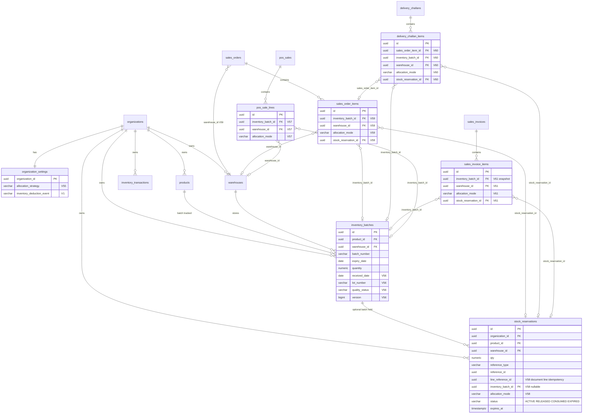
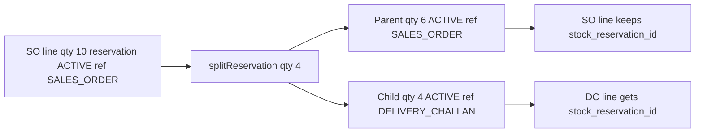

# Inventory allocation — database schema

Entity-relationship view of tables and columns introduced or extended for the **Smart Inventory Allocation Engine** (Phase 1 POS + Phase 2A/2B sales chain).

Related docs: [Phase 1 — POS](inventory-allocation.md) · [Phase 2 — SO / DC / Invoice](inventory-allocation-phase2.md)

---

## Entity relationship diagram



---

## Document → reservation reference types

`stock_reservations.reference_type` + `reference_id` tie a hold to a business document. `line_reference_id` (V58) scopes to a specific line for idempotency and partial splits.

| reference_type | Document | When created |
|----------------|----------|--------------|
| `SALES_ORDER` | Sales order | SO confirm (default org setting) |
| `DELIVERY_CHALLAN` | Delivery challan | Partial/full DC — split from SO reservation |
| `SALES_INVOICE` | Sales invoice | Legacy `INVOICE_CONFIRM` path (allocate at confirm) |

Reservation **status** lifecycle: `ACTIVE` → `RELEASED` (cancel) or `CONSUMED` (invoice confirm / dispatch).

---

## Allocation columns (shared pattern)

These columns appear on every allocated document line (POS, SO, DC, invoice):

| Column | Type | Purpose |
|--------|------|---------|
| `inventory_batch_id` | UUID → `inventory_batches` | Selected batch (null = warehouse pool) |
| `warehouse_id` | UUID → `warehouses` | Fulfillment warehouse |
| `allocation_mode` | VARCHAR(20) | How the batch was chosen |
| `stock_reservation_id` | UUID → `stock_reservations` | Active hold (SO / DC / invoice snapshot) |

**`allocation_mode` values** (CHECK constraint on all line tables):

| Value | Meaning |
|-------|---------|
| `WAREHOUSE_POOL` | Non-batch product; warehouse-level stock |
| `BATCH_AUTO` | Engine picked batch via org strategy |
| `BATCH_MANUAL` | Cashier/user confirmed batch after CONFLICT |

---

## Availability formula

Reservations reduce allocatable quantity before ledger deduct:

```text
warehouseAvailable = onHand(product, warehouse) − activeReserved(product, warehouse)
batchAvailable     = batch.quantity − activeReserved(batchId)
```

Implemented in `ReservationAvailabilityService` and used by allocators + `StockReservationService.reserve()`.

---

## Org settings (allocation-related)

| Column | Table | Migration | Default |
|--------|-------|-----------|---------|
| `allocation_strategy` | `organization_settings` | V55 | `FIFO` |
| `inventory_deduction_event` | `organization_settings` | V1 | `INVOICE_CONFIRM` |

**`allocation_strategy`:** `DEFAULT`, `FIFO`, `FEFO`, `LIFO`, `HIGHEST_QUANTITY`, `PREFERRED_WAREHOUSE`

**`inventory_deduction_event`:** controls reserve vs deduct timing — see [Phase 2 lifecycle table](inventory-allocation-phase2.md#locked-inventory-lifecycle-default)

---

## Flyway migrations (allocation)

| Version | File | Changes |
|---------|------|---------|
| V53 | `inventory_costing.sql` | `stock_reservations` base table |
| V55 | `organization_settings_allocation_strategy.sql` | `allocation_strategy` |
| V56 | `inventory_batch_allocation_fields.sql` | batch eligibility fields on `inventory_batches` |
| V57 | `pos_sale_lines_allocation.sql` | POS line allocation columns |
| V58 | `stock_reservations_batch_allocation.sql` | batch + mode + `line_reference_id` on reservations |
| V59 | `sales_order_allocation.sql` | `sales_orders.warehouse_id`, SO line allocation |
| V60 | `delivery_challan_allocation.sql` | DC line allocation + `sales_order_item_id` |
| V61 | `sales_invoice_allocation.sql` | Invoice line allocation snapshot |

---

## Indexes (allocation performance)

| Index | Table | Purpose |
|-------|-------|---------|
| `idx_inventory_batches_allocation` | `inventory_batches` | Strategy queries (org, product, warehouse, quality, expiry) |
| `idx_stock_reservations_batch` | `stock_reservations` | Batch reserved qty aggregation |
| `uq_stock_reservations_active_line` | `stock_reservations` | One ACTIVE reservation per document line |
| `idx_stock_reservations_org_product_wh` | `stock_reservations` | Warehouse pool reserved qty |

---

## Partial delivery (reservation split)

When a delivery challan ships less than the full SO line quantity:



Invoice confirm consumes the DC (or SO) reservation and posts a batch-aware `SALE` via `InventoryService.postPosSale`.
