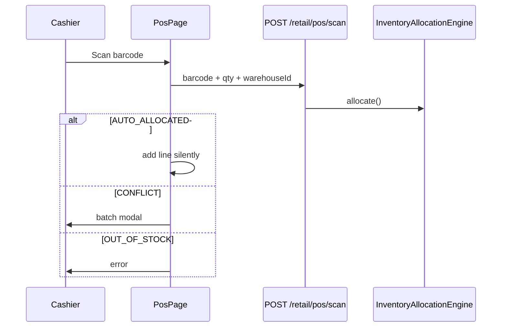
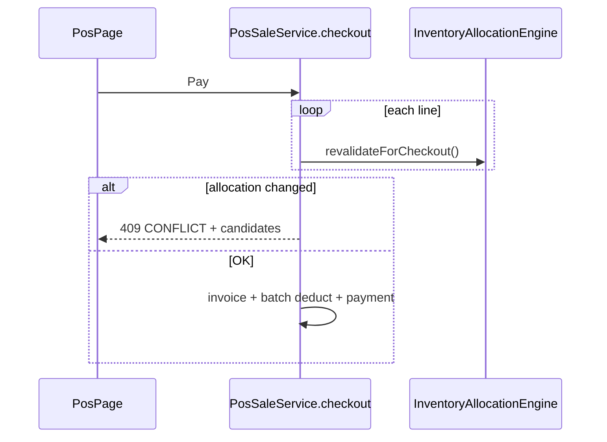

# Inventory Allocation Engine (Phase 1 — POS)

FlowLedger's allocation engine selects inventory for sales lines using org-configurable strategies. Phase 1 integrates **only** with POS barcode scan and checkout validation.

## Product behavior

### Non-batch products (`product.batchTracking = false`)

- Warehouse stock is treated as a **single pool** (ledger balance per warehouse).
- `AUTO_ALLOCATED` when `warehouseAvailableQty >= requestedQty` — no popup.
- `OUT_OF_STOCK` when insufficient — error toast.
- Never returns `CONFLICT` in Phase 1.

### Batch-tracked products (`product.batchTracking = true`)

- Full engine runs with org `allocation_strategy` (FIFO, FEFO, LIFO, HIGHEST_QUANTITY, PREFERRED_WAREHOUSE).
- `AUTO_ALLOCATED` when strategy picks a unique winner — no popup.
- `CONFLICT` when multiple batches tie — batch selection modal.
- `OUT_OF_STOCK` when no eligible batches.

Batch eligibility:

- `quality_status = AVAILABLE`
- Not expired (`expiry_date IS NULL OR expiry_date >= today`)
- `batch.quantity >= requestedQty`

## Scan flow



## Checkout validation

Before payment, checkout **re-runs** allocation inside one transaction:

1. Compare fresh allocation to cart (`inventory_batch_id`, `warehouse_id`, qty).
2. Non-batch: fail with `OUT_OF_STOCK` if pool insufficient.
3. Batch: return **409 CONFLICT** if batch changed or manual selection no longer valid.
4. Cashier confirms new batch via modal or removes line, then retries checkout.
5. On success: sales invoice (inventory posted separately with batch awareness), accounting, payment.



## API (Phase 1)

| Endpoint | Purpose |
|---|---|
| `POST /api/v1/retail/pos/scan` | Allocate on barcode scan |
| `POST /api/v1/retail/pos/scan/confirm` | Confirm manual batch after CONFLICT |
| `POST /api/v1/retail/pos/sales/{id}/lines` | Accept `inventoryBatchId`, `allocationMode`, `warehouseId` |
| `POST /api/v1/retail/pos/sales/{id}/checkout` | Returns 409 with `allocationChanged` + `lines[]` on conflict |

## Configuration

Organization setting `allocation_strategy` on `organization_settings` (default `FIFO`).  
Manage via **Settings → Operations → Batch Allocation Strategy**.

## Phase 2 (planned)

See **[inventory-allocation-phase2.md](inventory-allocation-phase2.md)** for the full breakdown. Summary:

| Sub-phase | Scope |
|-----------|--------|
| **2A** | Batch-aware stock reservations + engine availability |
| **2B** | Sales orders + delivery challans + invoice consume |
| **2C** | Warehouse transfers |
| **2D** | Sales + purchase returns |
| **2E** | Manufacturing — blocked until MRP module exists |
| **2F** | Nearest warehouse, serial/lot/bin, cross-warehouse (optional) |

Phase 1 POS integration remains as-is; Phase 2 adds reservations and document modules without replacing the engine facade.

## Package layout

```
com.flowledger.inventory.allocation
├── InventoryAllocationEngine      # Facade
├── WarehousePoolAllocator         # Non-batch path
├── BatchAllocationEngine          # Batch path + strategy dispatch
├── AllocationCandidateProvider    # Load/filter eligible batches
└── strategy.*                     # FIFO, FEFO, LIFO, ...
```
