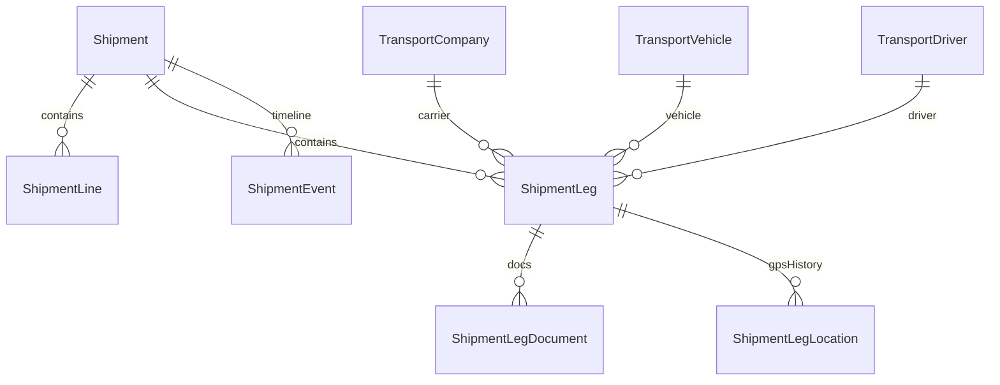

# Multi-leg transport — ERD and status maps

## Entity relationship

## Shipment status (kept — do not rename)

`DRAFT` → `SUBMITTED` → `APPROVED` → `ASSIGNED` → `LOADING` → `LOADED` →
`PARTIALLY_DISPATCHED` / `DISPATCHED` → `IN_TRANSIT` → `DELIVERED` → `CLOSED`
(+ `CANCELLED`, `REJECTED`)

### Mapping from requirements vocabulary

| Requirements | Existing |
|---|---|
| PLANNED | DRAFT / SUBMITTED |
| READY | APPROVED / ASSIGNED / LOADED |
| PARTIALLY_DISPATCHED | PARTIALLY_DISPATCHED |
| IN_TRANSIT | IN_TRANSIT |
| PARTIALLY_COMPLETED | mixed leg completion (service rollup → IN_TRANSIT / PARTIALLY_DISPATCHED) |
| COMPLETED | DELIVERED / CLOSED |
| CANCELLED | CANCELLED |

## Leg status (new)

`PLANNED` → `READY` → `DISPATCHED` → `IN_TRANSIT` → `ARRIVED` → `COMPLETED`
(+ `CANCELLED`)

## Rollup rules

1. Any non-cancelled leg `DISPATCHED`/`IN_TRANSIT`/`ARRIVED` → shipment at least `IN_TRANSIT` (or `PARTIALLY_DISPATCHED` when source challan still has remaining qty).
2. All non-cancelled legs `COMPLETED` → shipment `DELIVERED`.
3. Cancelled legs are ignored for completion.
4. Customer-arranged shipments may skip fleet assign/loading and dispatch from `APPROVED`.
